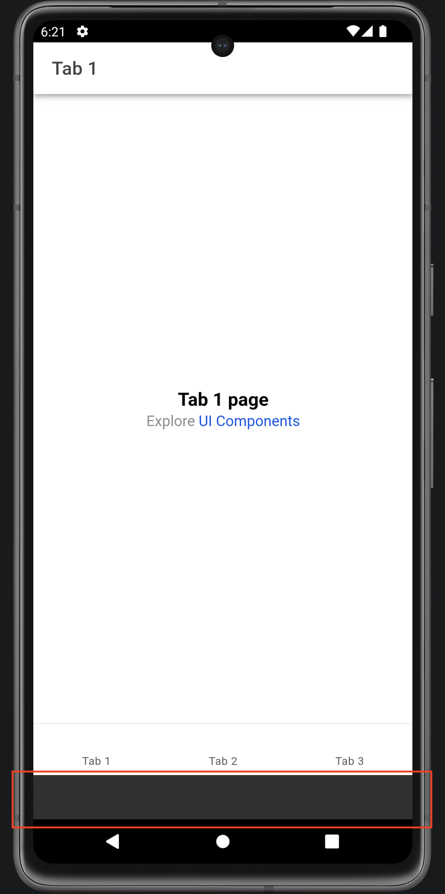

# Capacitor 8 SystemBar Bug

This is a simple Ionic (v8) tabs starter template project with Capacitor 8.3.0. No adjustments made, other than removing the `StatusBar` plugin, as we use the bundled `SystemBars` plugin.

When running Capacitor 8 on Android SDK < 35, a 'space' is added below the webview.

Setup with `npm install`, `npm run build`, `npx cap sync` then open and run in Android emulator (SDK API verison < 35).

